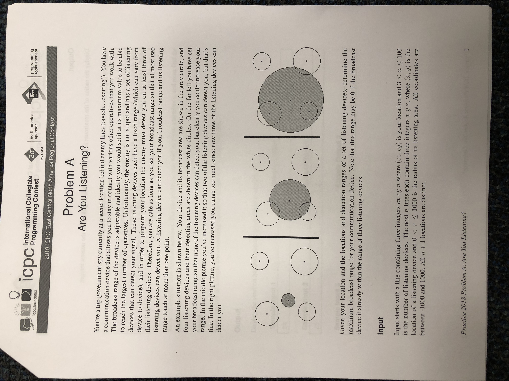

# Are you listening

Source:

 - ACM ICPC Regionals Practice 2018 Hosted @ University of Cincinnati

There are several complex ways to go about solving this problem, but the easiest, and
in some respects perhaps the most intuitive, starts with computing a list of all distances
between your position and the edges of all listening radii in the field. This might seem
difficult, but actually this distance is simply the euclidean distance between your start point
and the center of the listening device, minus the radius of the listening device's range (this
gives us the "left-over" distance between your start point and the arc of the listening device's
circle).

Each distance will represent how far you can expand your signal while still being out-of-range from
the associated device. Since we know we can be in-range of at most two devices, we are interested in
expanding our signal a total distance equal to the third-smallest distance in our list of calculated
distances, because that distance is the largest we can expand while potentially being in-range of two
devices, but definitely being out of the range of three. We can find the third smallest easily by sorting
our list of distances and polling it. This can be done as fast as we can sort the list, however I think we
can also find the third smallest value linearly, though that is slightly more complicated implementation-wise.

There is a tricky edge case that has to do with your position already being in-range of some devices
right off the bat. In this case the computed distance we care about will be negative, thus potentially
throwing off our final answer (we may return a negative "expandable" distance). Logically, we'll want to
normalize these values to `0` because that means we cannot expand any distance and still be out-of-range
from the associated distance. In other words, we are `0` distance units _away from_ the associated device's
signal range.

# Complexity analysis

 - Time complexity: O(nlog(n)) n = number of listening devices
 - Space complexity: O(n)
