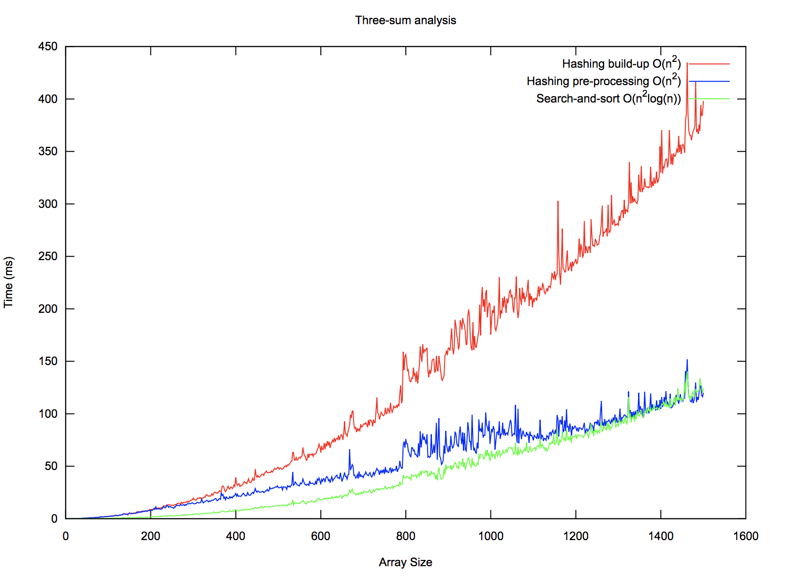

# 3 Sum

Source for this problem:

 - https://leetcode.com/problems/3sum/description/

I like this problem because it builds a little on top of the two-sum problem,
and therefore can be broken down to the two-sum problem just as easily.

In: array of integers
Out: array of unique triplets, whose sum = 0

A triplet is considered unique if it doesn't have the same three numbers as
another triplet, (ordering of the numbers is irrelevant).

# Naive

Of course we can consider all unique triplets in the array, and determine if

 - The sum of the triplet = 0
 - The triplet is unique

This is simple enough, and mostly just requires being able to store a triplet,
and later determine if another triplet is "equivalent" (non-unique) to any of
the other triplets whose sum = 0. This implies some sort of triplet-hashing would
be necessary, which might not be the simplest thing. Also, this is an extremely
inefficient solution.

## Complexity analysis

 - Time complexity: O(n3)
 - Space complexity: O(n) (storing potentially n unique triplets...at least I think n?)

# Sorting

My first intuition when looking at this problem was to treat it as the two-sum problem,
where the two sums in question were (arr[i] + arr[j]), and arr[k], where i, j, and k
are indices in the input array. So basically what we can do is consider all pairs, and
search in the remaining portion of the array for the third value that we could add to our
triplet sum to 0. We know that searching of course is relatively fast in a sorted array,
so we can sort our input array immediately when we get it. Now we just have to make sure
that we're not looking at duplicate with triplets. That's pretty easy since we sorted our
array, so the main thing we'll have to do is ensure we're not considering the same first
two numbers twice, but that is pretty easy by just seeing if you are considering the same
number back-to-back, when looking at a new first or second. Back-to-back is the only thing
we really care about, since we'll never re-visit a number we've already visited after leaving
it.

## Complexity analysis

 - Time complexity: O(n2log(n))
 - Space complexity: O(n)

# Hashing

The previous section indicates that the three-sum problem can be broken down into a membership
problem, a subproblem which we can solve in O(log(n)) time by searching through a sorted array.
Like the two-sum problem however, we can use a hash table or set (depending on what we're looking
for) to perform arr[k] existence look-ups in O(1) time. Also like the two-sum problem, we can use
our hash set/map in a couple different ways:

 1. We can pre-populate the map with every entry of the original array before we do our normal
    traversal. To ensure that we don't accidentally search the map for a number we're already using
    as one of the first two triplet numbers (and thus incorrectly use the same number twice), we'll
    have to maintain indices alongside each map entry. If the map contains the complement to our first
    two triplet numbers, we know we can safely use it if its index is > than the index of the second
    triplet number we're considering. This will indeed require a map as opposed to a set. To avoid
    duplicates, we can just sort the array beforehand, and ensure that we're never considering the same
    first or second triplet number twice (sorting makes this easy).
 2. We can attempt to do build our hash set/map up _as_ we traverse the list doing our work. In the two-sum
    algorithm, if the first number's complement wasn't found in our map, we inserted this first number into
    the map for later look-ups. In this case, we're essentially performing the two-sum problem for every fixed
    `i` (first triplet number). We consider every `j` to finish off our first number, and search for the the
    the complement ( -(nums[i] + nums[j]) ). If the complement exists, we found a good triplet! If it doesn't,
    we should insert nums[j] into our set, since it may be a relavent complement in the future. We can use a set
    here instead of a map because we don't care about indices. We can afford to not care about indices since we're
    building the set up as we go.

I think the first option is more intuitive and easier to weed out duplicates. However, the build-our-map-up-as-we-go
solution is always attractive too. So let's consider some of the nuances of (2)'s approach. We have to ensure we don't
add the same triplet to our return list of triplets more than once. It may feel like in order to ensure we're not considering
the same triplet twice, we should sort the array like we do in (1), so that we can skip over triplets that have the same first
and second numbers. If we don't do this, it might be easy to consider the triplet [1, 0, -1], after already looking at and
"approving" an earlier-but-equivalent triplet [-1, 0, 1].

Once we sort, we'll of course be iterating through all valid `i` and `j`, looking for a complementary `k`, and we should
be able to stop ourselves from looking at the same (`i`, `j`) pair twice...but do we want that? Consider the array [0, 0, 0].
This is a valid triplet we'd like to return. The first (`i`, `j`) pair we'll consider will be `0` and `0`.  We're looking for 
the complement `0` in the set. Oh no, it doesn't exist. In this case, we'll want to insert `0` into the set, and consider the
_next_ (`i`, `j`) pair, _also_ `0`, `0` (but at different indices). This time when we look for the complement, we find it in our
set because we just inserted it last time, so we want to save this triplet for returning. This means sometimes it pays to consider
the same (`i`, `j`) pair twice. It should be clear that considering the same pair _more_ than twice is useless though. If after not
being able to succeed by considering the pair the second time (with the duplicate value now in our set), we'll never succeed. So really
we have two things:

 - Once we find a successful triplet whose first two numbers are (`i`, `j`), we should stop considering pairs with the same first two
   (`i`, `j`), to save ourselves from adding that triplet twice.
 - Once we've looked at a triplet whose first two numbers are (`i`, `j`) twice and haven't found a match, as an efficieny optimization,
   we can stop considering all triplets with the same (`i`, `j`). This is not necessary to preserve the correctness of our algorithm, it
   can just help us do less work.

Those are the biggest things to look out for when implementing this version of the algorithm. Because there are some gotchas, it might be
easier to lean towards the sorted algorithm approach. Also, we'll have to be sure to reset our map every time we adjust `i` to preserve
correctness. See the implementation of this algorithm for more info.

## Complexity analysis

 - Time complexity: O(n2)
 - Space complexity: O(n)

# Performance analysis

The below plot indicates the performance of the following three approaches that we mentioned:

 - The (2) list item under the hashing section
 - The (1) list item under the hashing section
 - The sorting-then-searching approach, under the sorting section

I've listed them in this order, because I believe this is the order of expected descending performance.
Oddly enough, actually carrying out the performance study shows the exact opposite. It seems that perhaps
the overhead of using a hash set (and thus resetting it O(n) times) is more expensive than simply sorting
and searching. Hmm, interesting.

