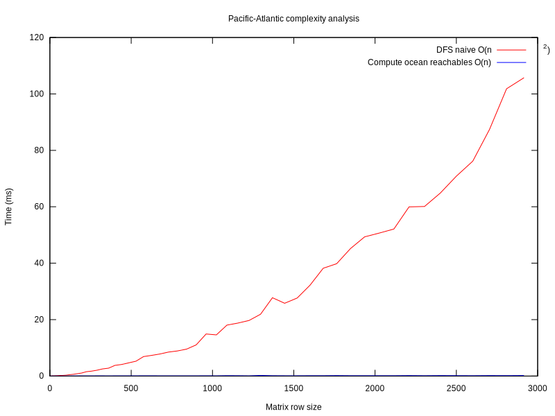

# Pacific Atlantic Water Flow

Source:

 - https://leetcode.com/problems/pacific-atlantic-water-flow/description/

This problem is pretty similar to [surroundedRegions](../surroundedRegions) and
[number of islands](https://leetcode.com/problems/number-of-islands/description/).
It is important to realize that we're not trying to determine whether or not pacific
water can flow into atlantic water or vice versa, but instead, if some water were to
start at some arbitrary point in the map, could water from that source make it to both
the pacific and the atlantic. In more technical terms, we care about sources that can
_reach_ the pacific and atlantic, not areas that are _reachable_ by them.

# Naive

The brute force solution here would be to, for every unit of land in the grid, do a DFS
out from said unit, and if the DFS eventually reaches a unit of land that:

 - borders that pacific, and
 - borders the atlantic

...we know the unit we started from should be included in our returned list of pairs.
The DFS will be O(n\*m), and we'll be carrying it out for each unit of land in the grid
(O(n\*m) times. This is really expensive because we're not saving any of our work, and
are constantly computing the same problems over and over.

DFS will recursively trigger other DFSs, and it would be ideal to save the result of sub-DFSs
somewhere as we go along to avoid duplication of work, however this introduces cycle issues that
would be encountered mid-traversal, which could leave us with incomplete answers (from what I've
encountered in my experimentation).

## Complexity analysis

 - Time complexity: O((n\*m)2)
 - Space complexity: O(n\*m) (to keep track of "visited" grid spots during each DFS traversal)

# Optimized

The reason our previous-but-inefficient solution worked is because it found our whether or not
some unit of land _could reach_ the pacific or atlantic, by seeing if it could every reach one
of the borders of our grid. We can make our solution more efficient by looking at the problem
the other way around; we can start with the ocean-bordering units of land that we guarantee can
reach their corresponding ocean, and DFS outward marking nodes that can reach these nodes as
reachable with regards to a specific ocean.

Once finished, we'll have all nodes that can reach the pacific _marked_, same as all nodes that
can reach the atlantic. The intersection of these two lists are units of land that we want to
return. The list of pacific- or atlantic-reachable units of land can just be another grid of
equal size to our input matrix, simply marking true or false for reachability. This gives us
fast look-up, an easy implementation, but at the expense of always using 2\*(n\*m) extra space.
This isn't too bad though, since if we were to use a hash table or unordered map to store the
coordinates, we'd be in the worst case using the same amount of space.

This type of solution is really powerful: instead of always looking for complex conditions to
be met from each individual point, go to the actual source, and find all positions that can reach
said source, and go from there. Implementation of this is relatively simple as well.

## Complexity analysis

 - Time complexity: O(n\*m)
 - Space complexity: O(n\*m)

// TODO(domfarolino): Add the picture here
