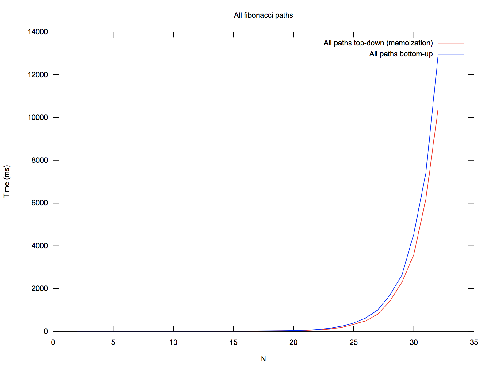

# All Paths

This is a modification of the [climbing stairs](../climbingStairs) problem, designed to not
only return the total number of unique paths to the top for _n_ steps, but the actual unique
paths themselves.

# Top-down approach

As with the original problem, we have two solid dynamic programming-based approaches. If we
look at the problem as a top-down recursion problem, we get the following recurrence:

```
totalPaths(n) = (totalPaths(n - 1) + "n") + (totalPaths(n - 2) + "n")
```

...with the base cases totalPaths(1) = [[1]], totalPaths(2) = [[2], [1, 2]]. This yields the
following recursion tree if we use memoization to save the paths of previously-computed subproblems.

```
                          (8)  totalPaths(5)
                       /                        \
               (5) totalPaths(4)         (0) totalPaths(3)
                /             \
       (3) totalPaths(3)   (0) totalPaths(2)
             /            \
  (0) totalPaths(2)   (0) totalPaths(1)


** The (n) next to the totalPaths(n) label means ~the amount of the "work"
required for that computation. Here the amount of work represents how much
"merging" we'll be doing the first time we compute each subproblem. For example
the amount of work required at a node whose children are the calls, totalPaths(3)
and totalPaths(2) will be (5), because the length of the total paths for each subproblem
is 2 and 3 respectively, so we have to merge all 5 of these answers to a single data
structure to return.

Note that the amount of work required for each right child of a node is (0) because by
the time we recurse on totalPaths(n - 2), we've already ran totalPaths(n - 1), which covers
totalPaths(n - 2). Therefore the answer totalPaths(n - 2) is available to us in O(1) time.
You could make the argument that there is non-O(1) amount of work to be done here because
depending on the implementation, we'll likely make copies of these O(1)-retrievable memoized
answers when moving them to a higher-up stack frame, but see later notes for why I don't think
tamper with the asymptotic complexity of the algorithm.
```

## Analysis and "duplicated work"

If we add up the amount of work in that tree, after using memoization, we see we have
_approximately_ 3 + 5 + 8 work total, where 8 is the number of unique paths to the top
of a staircase with 5 steps. We can see this scales with fib(n), summing the first _n_
fibonacci numbers. Normally this identical-shaped tree, when we're only interested in the
_number_ of paths, costs O(n) to traverse. Here it is much more expensive and exponential
due to the fibonacci sequence, because we're iterating through all subpaths at a given level
which is expensive and repetitive. There is some wasteful work we're doing too:

 1. At each given node, it is true that we have to spend O(fib(n)) time at that node iterating
    through each subproblem and merging them. This is the reason this algorithm is exponential
    in time complexity. Furthermore, we'll make an entirely new copy of this node when we return
    its answer to a higher-up stack frame. This effectively doubles the work we do at each node.
 2. As mentioned before, it "costs us nothing(TM)" to pull totalPaths(i) when _i_ is in our
    memo, but technically, as an implementation detail, we'll have to copy the answer from
    the memo, which will be O(fib(n)) where `n` is the size of that specific memoized answer.
    Furthermore, like in (1), once we have this copy made, we'll have to make another copy of it
    just to return it to a higher stack frame. This is an implementation detail that can likely
    be avoided.

The above two steps indicate where we are duplicating work, largely by virtue of programming
language and implementation detail. Some of it can be avoided (pulling memoized subproblem answers
in the stack frame that you'll use it instead of recursing and making the copy, using move semantics,
etc), but I don't believe any of this duplicated work actually effects the asympotic complexity of the
algorithm, and instead just adds some lower-order overhead.

<details>
  <summary>Extra copies probably don't effect asymptotic complexity</summary>

  It is true that depending on our implementation, we'll be making extra copies of
  each subproblem we encounter, both the subproblems we get in O(1) from our memo,
  and the answers we return after merging at each level. This duplicates a lot of
  work because it does everything twice, but the reason I don't think this changes
  the asymptotic complexity, and instead just adds a larger lower-order overhead is
  because consider the sum of the first `n` numbers. The answer is O(n^2), and even
  if you double each number that you sum along the way (i.e., do twice the work), you
  end up with O(n^2)\*2 = O(n^2). With this said I think this translates smoothly to
  our problem, and the amount of work we're doing is almost perfectly doubled, thus
  not affecting the asymptotic complexity of the algorithm.
</details>

# Bottom-up approach

With the top-down approach, we see that in the above approach we recurse all the way down
to the bottom of the tree, winding back up in perfect order of ascending _i_ values for
totalPaths(i). We of course are saving the result of previous subpaths to merge at each
level. Instead of recursing down just to come back up, with the bottom-up approach we'll
start with the base cases, and inchworm our way up, merging the results of totalPaths(i - 1)
and totalPaths(i - 2) as we go. This is precisely what we did with the bottom-up solution in
[climbing stairs](../climbingStairs), modulo the merging. Since we're still doing a bunch of
merging, the solution is bounded by the sum of the first _n_ fibonacci numbers even though the
algorithm design is similar to the O(n) [climbing stairs](../climbingStairs) algorithm (which
doesn't do a bunch of merging!).

We can choose to maintain an entire table of subproblems, or just two subproblem variables and a
temporary one that we'll use to keep merging as we go up. The latter is a space optimization.

# Complexity analysis

 - Time complexity: O(Σ{n}(fib(n))) = exponential (not sure the exact parameters)
 - Space complexity: O(fib(n) * Bn), where Bn = Binet's formula (the bound of each unique path length: [**see here**](https://math.stackexchange.com/questions/67707/))

# Performance analysis

The below graph indicates that the top-down and bottom-up approaches are indeed asympotically equivalent,
as expected. Variants are likely due to the number of lower-order copies we're doing, amongst other implementation
details.


