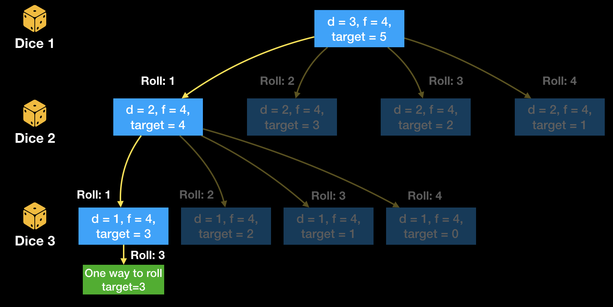

# Number of Dice Rolls With Target Sum

Source:

 - https://leetcode.com/problems/number-of-dice-rolls-with-target-sum/description/

The problem description is as follows:

> You have d dice, and each die has f faces numbered 1, 2, ..., f.
> Return the number of possible ways (out of fd total ways) modulo
> 10^9 + 7 to roll the dice so the sum of the face up numbers equals target.

# Top-down DFS + dynamic programming

This is a really interesting problem IMO, and I like how it generalizes, with
dice with an arbitrary number of faces. I went about approaching this as a
backtracking problem, where we break the problem into many subproblems that we
try and solve. Naturally this lends itself to the top-down dynamic programming
memoization so we avoid solving the same subproblems over and over again.

I looked at the problem like this: We consider the first die. With this die, we
can any number in the range [1, f]. We'll simulate rolling each of these numbers
`n in [1, f]`, and consider the subproblem of rolling `target - n` with the remaining
`d - 1` dice. We can continue breaking the problem down into subproblems in a
DFS-manner with these simulated rolls and updated targets, until we get to the trivial
case where we have one die to roll, and a given target. We *can* roll the target sum
with one die if the target is within the range [1, f]. This gives us a tree like so:

When we get to the bottom level, we know how many ways there are to roll `target` (if
any) with all dice/target combinations `<d, target>` in the current DFS path. As we unwind
our recursion, we should save our results in a map `{<d, target>: possibilities}`. We'll
consult this map before we recurse; it is the "memo" in memoization.

Clearly the total tree can be quite large, since we have a branching factor of `f` and
a depth of `d + 1` nodes and `d` edges. The overall size of this tree will be
_O(fd + 1)_ which is quite large, but our memoization prevents us from traversing
the entirety of it.

## Complexity analysis

 - Time complexity: As mentioned, the tree size and full traversal would be _O(fd + 1)_,
   but we don't have to pay that full price with memoization, however I'm not sure how to quantify
   the savings in terms of asymptotic complexity.
 - Space complexity: Without memoization, the space would be implicit with recursive stack frames
   being _O(d)_. With memoization....TODO.

# Bottom-up dynamic programming

TODO(domfarolino): I believe we can also do this in a bottom-manner with a 2d-array as our dynamic
programming cache. I should write this solution.

## Complexity analysis

 - Time complexity: O(d\*f\*target)
    - Because we have to iterate through the entire d\*target table, and for each entry, accumulate
      the sum of the _f_ subproblems that compose it
 - Space complexity: O(d\*target), which is the size of our dynamic programming table
