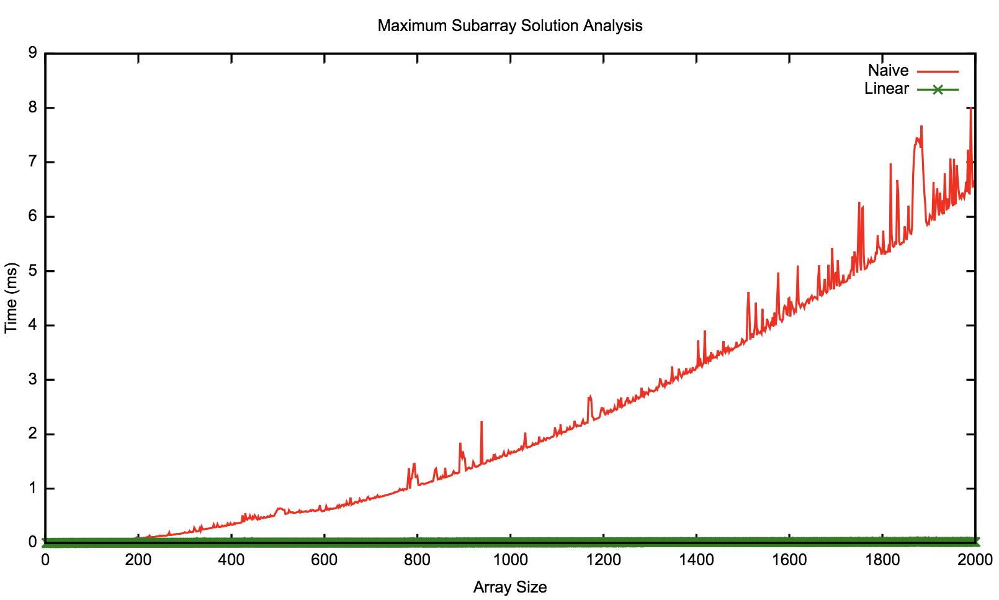

# Maximum (Sum) Subarray

## Naïve solution

This is quite an interesting problem, and lends itself to a rather straightforward
naive solution. Basically if we were to try and find the subarray with the largest sum
(the maximum sum subarray), we could do so pretty easily by just seeing what the maximum
possible subarray starting at a given element would be, and just do that for each element,
keeping track of the max. Consider the following array:

[1, 2, -4, 5, -2, 9]

All of the subarrays starting with `1` are:

| Subarray      | Sum |
|---------------|-----|
| [1]           | 1   |
| [1, 2]        | 3   |
| [1, 2, -4]    | -1  |
| [1, 2, -4, 5] | 4   |
| [...so on]    | x   |

The max of which is finally 11. We can keep track of this max, and compare it against the max of
all of the other `n - 1` tables. We can see that the number of subarrays at a given index is bounded
by `n`, thus making this trivial solution quite slow. Ultimately in this example, we'll see that the
max of the max subarrays has a sum of 12, and is the array [5, -2, 9].

### Complexity analysis:

 - Time complexity: O(n2)
 - Space complexity: O(1)

## Optimal Solution (dynamic programming)

In the above example, we're doing a ton of work. It'd be nice to make the realization that the reason
[5, -2, 9] is the maximum subarray, as opposed to [1, 2, -4, 5, -2, 9], is because the subarray
[1, 2, -4] has a negative sum, so any subarray concatenated onto it is damaged by having it as a prefix.
In other words, when we get to the point where we are to see what the result of adding `5` to [1, 2, -4]
will be, we can optimize our approach by saying "Wait, that's less than just starting over at `5`. No need
to tack `5` onto the negative prefix if I'd be in a better place just starting over at `5`".

It feels like we just skipped over all subarrays that could start with `2` here, or for that matter,
any value in between the original start, and the new start that we jumped to right? We did! And the reason
that's ok is because by the time we got to those values, it was still beneficial to have the prefix subarray
we started before getting there. There's no reason to drop the `1`, from [1, 2, ...], because it'll just lead
to a lower value. Any subarray starting with `2` can _only be enhanced_ by adding `1` to the beginning. In other
words, by the time we got to `2`, we didn't have a reason to drop the prefix, because it was helping. Finally, when
we dipped into the negatives, we realized it'd make more sense to just start over. This solution is nice, and is
basically a sliding window kinda solution rooted in dynamic programming principles.

This is exactly the logic we use in the approach based off of Kadane's maximum sum subarray algorithm. It
is a dynamic programming solution, where we essentially keep track of what the maximum sum subarray could be
if it were to _end_ at any given element. If the sum is ever negative, we know that we can be in a better place
by starting over at the next not-so-bad solo value. To read more about Kadane's algorithm approach, check out my
[blog post](https://blog.domfarolino.com/Maximum-Subarray-Study/) on this topic, which goes into much more detail.

### Complexity analysis:

 - Time complexity: O(n)
 - Space complexity: O(1)

## Performance analysis

Of course the difference between O(n2) and O(n) is probably obvious to most of the
readers here, but since it's fun creating and analyzing data, here's a nifty chart I made with gnuplot:

For more reading, check out my [blog post](https://blog.domfarolino.com/Maximum-Subarray-Study/) post which
goes into a little more detail.
