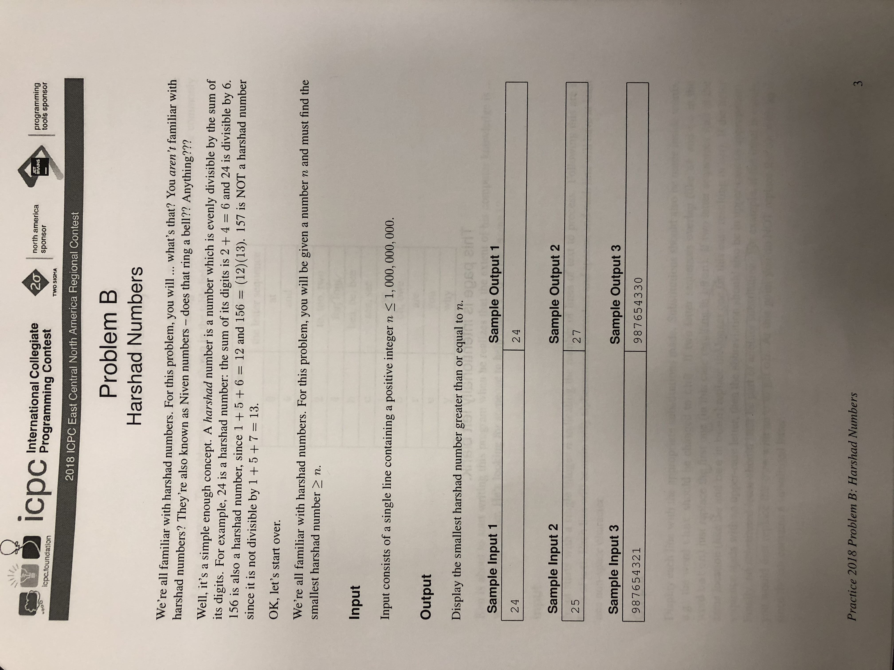

# Harshad Numbers

Source:

 - ACMICPC Regionals 2018 Hosted @ University of Cincinnati

This is a relatively straight-forward brute-force algorithm, which
practically does not need explained at all.

# Complexity analysis

 - Time complexity: O(log(n)\*k), where n = the nth harshad number, and k is the
   gap between the input number and the next harshad number (I don't know the exact
   relationship between/formula of the harshad numbers so I am just generalizing the
   complexity to this text)
 - Space complexity: O(1)
