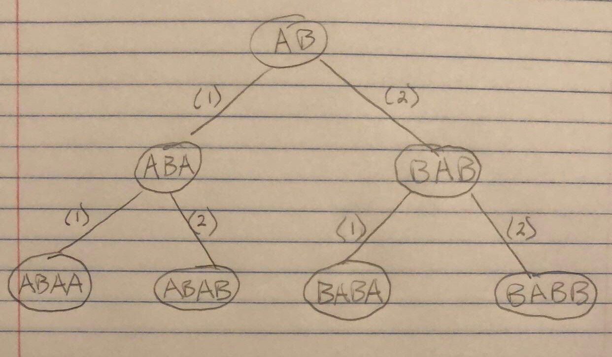

# Initial to Target (ABBA)

Source:
 - [Topcoder](https://arena.topcoder.com/#/u/practiceCode/16527/48825/13918/2/326683)

This is a pretty interesting problem; the input is two strings, `initial` and `target`
consisting of only 'A's and 'B's. The goal is to return whether or not you can create
the `target` string from `initial`, by only performing one of two operations on
`initial` at any given time:

 1. You can add an 'A' to the end of the string
 1. You can reverse the string and add 'B' to the end of it

### Examples

In: "A", "AB"

Out: true; by rule (2) you can reverse the string, producing "A", and add "B" to the end

----

In: "AB", "BABA"

Out: true; by rule (2) you can produce "BAB", and by rule (1) you can produce "BABA"

----

## Naive Search Approach

The naive approach to this solution (not implemented here) is to basically, from the
`initial` string, generate all possible strings as long as `target`, and check to see
if any of them equal `target`. This is of course very expensive, but we can do so in a
BFS fashion. First, consider the binary tree that can be made from `initial`:

In: "AB", "BABA"



With this, a natural jump would be to treat strings as nodes, and perform a
breadth-first-search starting from `initial`. We'd stop evolving a given string
in the BFS queue when its length equals that of `target`. At this point, we'd
check to see if the string equals `target`. If it does, we're set. If not, we
discard it and move to the next. If we've exhausted all of the strings without
finding one equal to `target`, we know we can return false or something indicating
that `init` cannot be evolved into `target`.

This is a really simple and naive algorithm, ignoring a lot of potential places of
optimization.

### Complexity analysis

Since we're constructing a perfect binary tree, we know that the complexity of this
algorithm is going to be bounded by the number of nodes in the tree. Trivially we know
the number of levels in the tree is directly proportional to the length difference of
`target` and `initial`, which we'll call `k` (that is, `k = target.size() - init.size()`.
Specifically, there are `k` levels in the tree we can produce, which means:

 - The number of leaf nodes will be 2^k; [proof](https://blog.domfarolino.com/Binary-Tree-Inductive-Proofs/#perfect-binary-tree-proof-3)
 - The number of nodes in the tree wil be 2^(k + 1) - 1; [proof](https://blog.domfarolino.com/Binary-Tree-Inductive-Proofs/#perfect-binary-tree-proof-2)

The number of leaf nodes is the amount of strings that we'll have to store in our
BFS queue at any given time, which is a clue to our space complexity (we'll have to
multiply this number by the string length), however the total number of nodes in the
tree is what we'll have to iterate through to produce the leaves we're interested in.
Therefore:

 - Time complexity: O(2^(k + 1))
 - Space complexity: O(m\*2^k); where `m = target.size()`

## Work-backwards Optimization

### Key Realization

As mentioned, the previous solution is very naive and misses a lot of opportunity for
optimization. For example, my first realization was that if `initial` even had a chance
to evolve into `target` it should definitely appear as a substring of `target`. From here,
we could find this substring, and inchworm our way outwards from the ends of the substring
to determine if the subsequently outter letters could be legally added.

For example, really simple instances of this is are:

In: "ABB", "ABBAA"

We can find the substring "ABB" in "ABBAA" at indices [0, 2]. We'll call these `i` and `j`,
and we can slowly inch outwards to the ends, in this case examining the 'A's, determining
at each step if we can add them to the substring [0, 2]. Here we expand the substring to
[0, 3] and so on.

Introducing 'B's make it a little more complicated, consider another example:

In: "XY", "BXYB" (just using "XY" here to make a clear distinction between `initial` and `target`)

Note that we can produce "BXYB" from "XY" just by applying rule 2 (the "B" rule) twice.

```
      (2)     (2)
XY => YXB => BXYB


Step 1.) (found the substring [i, j] in target)
  i j
B X Y B

Step 2.) (from applying rule 2)
j   i
B Y X B

Step 3.) (from applying rule 2)
i     j
B X Y B
```

Clearly we can see what kind of steps we'd need to perform when we find `initial` as a
substring in `target`, and it forms an algorithm. We find the substring, and depending
on the surrounding characters, either increment `j` to simulate rule (1), or reverse the
indices and decrement `j` to simulate rule (2). We'll have similar rules for when our
indices are inverted. The algorithm may look like this:

1. If i < j
    1. If target[j + 1] == "A"
        1. j++ // rule (1)
    1. If target[i - 1] == "B"
        1. Reverse indices
        1. j-- // rule (2)
1. If j > i (when the indices are reversed)
    1. If target[j - 1] == "A"
        1. j-- // rule (1)
    1. If target[i + 1] == "B"
        1. Reverse indices
        1. j++ // rule (2)

We'll want to run this until `i` and `j` span the entirety of `target`. At this point,
if `i < j`, we know we can produce `target` from `initial`. Else, we cannot. (Note we'll
also need some bounds checking, but the above algorithm is just a rough outline).

It works, but is a little complicated because of what the 'B's can do. For example, consider:

In: "AB", "BABA"

We find `initial` as a substring of `target` from [1, 2]. From here we look at the following
'A' and determine that we can produce [1, 3] from [1, 2]. However now we realize it is
impossible to add 'B' at index 0 here, indicating we cannot legally the substring [1, 2] to
`target`. This analysis isn't sufficient since we can show that "BABA" _can indeed_ be produced
by "AB" by applying rule (2) and then rule (1).

```
Step 1.)
i j
A B

Step 2.) (from applying rule 2)
j i
B A B

Step 3.) (from applying rule 1)
j i
B A B A
```

Here we can see that it is possible for `initial` to be reversed in the substring of `target`
and we need to account for this. Instead of always looking for normal substrings
of `target` that match `initial` and simulating the mutations with our `i` and `j`, we also need
to consider all reverse substrings that match `initial`, and continue in the same way.

We'd run our algorithm on all `i`s and `j`s corresponding to the forward and reverse substrings
of `target` that match `initial` and if any of them return true, we know we can stop. This is
a bit tedious though, as there can be many many substrings to try out.

### Optimization

A better way of handling this is to think of the problem backwards. If we start with `target`
and try to reduce it to `initial`, we have much less to consider. We know that both of the rules
can only add characters to the end of a string, so we can just look at the last character of
`target` at any given time, and act accordingly.

 - If last character is 'A', remove it (`std::string::pop_back` will do)
 - If last character is 'B', remove it and reverse the string

We'll do this until the size of `target` is reduced to the size of `initial`, and do an equality
check between `initial` and the new `target` after our mutations. Note that the worst case is a
string full of 'B's, and will lead to O(n) reversals, each taking O(n) time, a grand total of
O(n<sup>2</sup>).

As an optimization, we can use index variables `i` and `j` to represent the bounds of `target`
without actually mutating it. This turns each O(n) reversal into an O(1) variable swap (more or less),
giving us a big performance improvement, since we're not actually mutating `target`. When we're
finished, we need to perform an equality check between `initial` and the substring of target [i, j].
(We also need to account for when `i` and `j` are inverted, since as we demonstrated, `initial` may
appear as a reverse substring in `target).

### Complexity analysis

 - Time complexity: O(n)
 - Space complexity: O(1)
